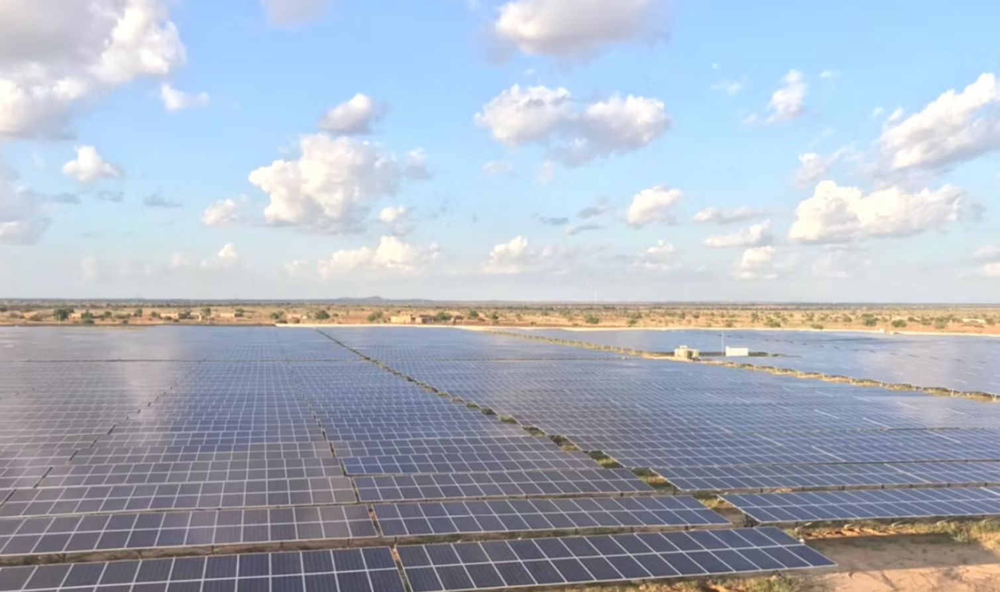

<!DOCTYPE html>
<html lang="ja">
<head>
    <meta charset="UTF-8">
    <meta name="viewport" content="width=device-width, initial-scale=1.0">
    <title>Octo Energy (オクトエナジー) - あなたの太陽光発電収益を最大化</title>
    
    <!-- Tailwind CSS -->
    
    
    <!-- Google Fonts: Inter & Noto Sans JP -->
    <link rel="preconnect" href="https://fonts.googleapis.com">
    <link rel="preconnect" href="https://fonts.gstatic.com" crossorigin>
    <link href="https://fonts.googleapis.com/css2?family=Inter:wght@400;600;700&family=Noto+Sans+JP:wght@400;500;700&display=swap" rel="stylesheet">
    
    <!-- Custom Styles -->
    
</head>
<body class="bg-gray-900 text-white">

    <!-- Header -->
    <header class="bg-gray-900/80 backdrop-blur-sm sticky top-0 z-50 border-b border-gray-800">
        

            <a href="#" class="text-2xl font-bold gradient-text flex items-center">
                <svg xmlns="http://www.w3.org/2000/svg" width="28" height="28" viewBox="0 0 24 24" fill="none" stroke="currentColor" stroke-width="2" stroke-linecap="round" stroke-linejoin="round" class="mr-2 text-cyan-400"><path d="M12 2.69l5.66 5.66a8 8 0 1 1-11.31 0z"></path></svg>
                Octo Energy
            </a>
            <nav class="hidden md:flex space-x-8 items-center">
                <a href="#problem" class="hover:text-cyan-400 transition-colors">課題</a>
                <a href="#solution" class="hover:text-cyan-400 transition-colors">解決策</a>
                <a href="#features" class="hover:text-cyan-400 transition-colors">機能</a>
                <a href="#ux" class="hover:text-cyan-400 transition-colors">使いやすさの追求</a>
                <a href="#pricing" class="hover:text-cyan-400 transition-colors">料金</a>
                <a href="#contact" class="bg-cyan-500 hover:bg-cyan-600 text-white font-bold py-2 px-4 rounded-lg transition-transform transform hover:scale-105">
                    お問い合わせ
                </a>
            </nav>
            <button id="mobile-menu-button" class="md:hidden text-white focus:outline-none">
                <svg class="w-6 h-6" fill="none" stroke="currentColor" viewBox="0 0 24 24" xmlns="http://www.w3.org/2000/svg"><path stroke-linecap="round" stroke-linejoin="round" stroke-width="2" d="M4 6h16M4 12h16m-7 6h7"></path></svg>
            </button>
        

        <!-- Mobile Menu -->
        

            <a href="#problem" class="block py-2 px-6 text-sm hover:bg-gray-800">課題</a>
            <a href="#solution" class="block py-2 px-6 text-sm hover:bg-gray-800">解決策</a>
            <a href="#features" class="block py-2 px-6 text-sm hover:bg-gray-800">機能</a>
            <a href="#ux" class="block py-2 px-6 text-sm hover:bg-gray-800">使いやすさの追求</a>
            <a href="#pricing" class="block py-2 px-6 text-sm hover:bg-gray-800">料金</a>
            <a href="#contact" class="block py-2 px-6 text-sm hover:bg-gray-800">お問い合わせ</a>
        

    </header>

    <!-- Main Content -->
    <main>
        <!-- Hero Section -->
        <section class="relative text-center py-20 md:py-32 px-6 overflow-hidden">
            

            
            <h1 class="text-4xl md:text-6xl font-bold mb-4 leading-tight">
                眠っている太陽光の価値を 
                最大限に引き出す。
            </h1>
            

                オクトエナジーは、AIがあなたの太陽光発電の売電収益を最大化する「パーソナル・エネルギー・トレーディングプラットフォーム」を提供します。面倒な売電先選びから解放され、スマートなエネルギー運用を始めましょう。
            

            <a href="#pricing" class="bg-gradient-to-r from-cyan-500 to-blue-500 hover:from-cyan-600 hover:to-blue-600 text-white font-bold py-3 px-8 rounded-lg text-lg transition-transform transform hover:scale-105 inline-block">
                料金プランを見る
            </a>
            

                <svg xmlns="http://www.w3.org/2000/svg" width="20" height="20" viewBox="0 0 24 24" fill="none" stroke="currentColor" stroke-width="2" stroke-linecap="round" stroke-linejoin="round" class="mr-2"><path d="M21 10c0 7-9 13-9 13s-9-6-9-13a9 9 0 0 1 18 0z"></path><circle cx="12" cy="10" r="3"></circle></svg>
                まずは九州・山口県エリアからサービスを拡大中です
            

        </section>

        <!-- Problem Section -->
        <section id="problem" class="py-20 bg-gray-800/50">
            

                <h2 class="text-3xl md:text-4xl font-bold mb-4">こんな悩み、ありませんか？</h2>
                
FIT制度終了（卒FIT）後、太陽光発電の運用はより複雑になっています。

                

                    

                        <h3 class="text-xl font-bold mb-2 flex items-center">
                            <svg xmlns="http://www.w3.org/2000/svg" width="24" height="24" viewBox="0 0 24 24" fill="none" stroke="currentColor" stroke-width="2" stroke-linecap="round" stroke-linejoin="round" class="text-red-400 mr-3"><path d="M17 18a5 5 0 0 0-10 0"></path><line x1="12" y1="2" x2="12" y2="9"></line><line x1="4.22" y1="10.22" x2="5.64" y2="11.64"></line><line x1="1" y1="18" x2="3" y2="18"></line><line x1="21" y1="18" x2="23" y2="18"></line><line x1="18.36" y1="11.64" x2="19.78" y2="10.22"></line><line x1="23" y1="22" x2="1" y2="22"></line><polyline points="8 6 12 2 16 6"></polyline></svg>
                            売電価格が大幅に下落した
                        </h3>
                        
FIT期間中のような高値での売電はもう終わり。何もしなければ、収益は大きく減少してしまいます。

                    

                    

                        <h3 class="text-xl font-bold mb-2 flex items-center">
                            <svg xmlns="http://www.w3.org/2000/svg" width="24" height="24" viewBox="0 0 24 24" fill="none" stroke="currentColor" stroke-width="2" stroke-linecap="round" stroke-linejoin="round" class="text-blue-400 mr-3"><path d="M21 16V8a2 2 0 0 0-1-1.73l-7-4a2 2 0 0 0-2 0l-7 4A2 2 0 0 0 3 8v8a2 2 0 0 0 1 1.73l7 4a2 2 0 0 0 2 0l7-4A2 2 0 0 0 21 16z"></path><polyline points="3.27 6.96 12 12.01 20.73 6.96"></polyline><line x1="12" y1="22.08" x2="12" y2="12"></line></svg>
                            どの電力会社を選べば良いかわからない
                        </h3>
                        
買取先の新電力が様々なプランを提供しており、最適な選択肢を個人で見つけるのは骨が折れます。

                    

                

            

        </section>

        <!-- Solution Section -->
        <section id="solution" class="py-20">
            

                

                    <h2 class="text-3xl md:text-4xl font-bold mb-4">
                        その悩み、Octo Energyが解決します
                    </h2>
                    

                        私たちは、オクトソーラーシステム（特許申請中）を使いあなたの利益を最大化するAIを提供します。（詳細はお問い合わせください）
                    

                

                

                    

                    
                

            

        </section>

        <!-- Features Section -->
        <section id="features" class="py-20 bg-gray-800/50">
            

                

                    <h2 class="text-3xl md:text-4xl font-bold mb-4">主な機能</h2>
                    
専門知識は不要。AIがあなたのエネルギー資産運用を最適化します。

                

                

                    <!-- Feature 1: Visualize -->
                    

                        

                            <svg xmlns="http://www.w3.org/2000/svg" width="24" height="24" viewBox="0 0 24 24" fill="none" stroke="currentColor" stroke-width="2" stroke-linecap="round" stroke-linejoin="round"><path d="M3 3v18h18"></path><path d="M18.7 8a6 6 0 0 0-8.3-5.3"></path><path d="M13 12.5a4.5 4.5 0 0 1 5-5.5"></path></svg>
                        

                        <h3 class="text-xl font-bold mb-2">① 可視化・分析</h3>
                        
発電量や売電収益をリアルタイムで直感的に把握。漠然とした不安を解消し、資産状況を正確に把握できます。

                    

                    <!-- Feature 2: Maximize -->
                    

                        

                            <svg xmlns="http://www.w3.org/2000/svg" width="24" height="24" viewBox="0 0 24 24" fill="none" stroke="currentColor" stroke-width="2" stroke-linecap="round" stroke-linejoin="round"><path d="M12 2v20M17 5H9.5a3.5 3.5 0 0 0 0 7h5a3.5 3.5 0 0 1 0 7H6"></path></svg>
                        

                        <h3 class="text-xl font-bold mb-2">② 収益最大化</h3>
                        
AIが全国の電力会社のプランを比較分析し、あなたに最適な売電先を自動で推奨。機会損失を防ぎます。

                    

                    <!-- Feature 3: Automate -->
                    

                        

                            <svg xmlns="http://www.w3.org/2000/svg" width="24" height="24" viewBox="0 0 24 24" fill="none" stroke="currentColor" stroke-width="2" stroke-linecap="round" stroke-linejoin="round"><path d="M20 7h-9"></path><path d="M14 17H5"></path><circle cx="17" cy="17" r="3"></circle><circle cx="7" cy="7" r="3"></circle></svg>
                        

                        <h3 class="text-xl font-bold mb-2">③ 自動化・効率化</h3>
                        
面倒な電力会社の切り替え手続きもシステムがサポート。時間と手間を大幅に削減します。

                    

                

            

        </section>

        <!-- UI/UX Section -->
        <section id="ux" class="py-20 bg-gray-900">
            

                

                    <h2 class="text-3xl md:text-4xl font-bold mb-4">最高の使いやすさを実現する技術</h2>
                    
プロのエンジニアが、ユーザー体験（UI/UX）を徹底的に追求しました。

                

                

                    <!-- UX 1: Onboarding -->
                    

                        

                            <svg xmlns="http://www.w3.org/2000/svg" width="24" height="24" viewBox="0 0 24 24" fill="none" stroke="currentColor" stroke-width="2" stroke-linecap="round" stroke-linejoin="round"><path d="M13 2H6a2 2 0 0 0-2 2v16a2 2 0 0 0 2 2h12a2 2 0 0 0 2-2V9z"></path><polyline points="13 2 13 9 20 9"></polyline></svg>
                        

                        <h3 class="text-xl font-bold mb-2">かんたん初期設定</h3>
                        
主要メーカーのパワーコンディショナーに対応。アプリの案内に従うだけで、誰でも数分でシステム連携が完了します。

                    

                    <!-- UX 2: Dashboard -->
                    

                        

                            <svg xmlns="http://www.w3.org/2000/svg" width="24" height="24" viewBox="0 0 24 24" fill="none" stroke="currentColor" stroke-width="2" stroke-linecap="round" stroke-linejoin="round"><rect x="3" y="3" width="18" height="18" rx="2" ry="2"></rect><line x1="3" y1="9" x2="21" y2="9"></line><line x1="9" y1="21" x2="9" y2="9"></line></svg>
                        

                        <h3 class="text-xl font-bold mb-2">直感的なダッシュボード</h3>
                        
「今日の売電収益」「最適な売電先の候補」など、知りたい情報が一目でわかるデザイン。複雑なデータをシンプルに見せます。

                    

                    <!-- UX 3: Performance -->
                    

                        

                            <svg xmlns="http://www.w3.org/2000/svg" width="24" height="24" viewBox="0 0 24 24" fill="none" stroke="currentColor" stroke-width="2" stroke-linecap="round" stroke-linejoin="round"><polygon points="13 2 3 14 12 14 11 22 21 10 12 10 13 2"></polygon></svg>
                        

                        <h3 class="text-xl font-bold mb-2">高速・快適なパフォーマンス</h3>
                        
最新のウェブ技術を採用し、スマートフォンでもストレスなく軽快に動作。いつでもどこでも、快適なエネルギー管理を実現します。

                    

                

            

        </section>

        <!-- Pricing Section -->
        <section id="pricing" class="py-20">
            

                <h2 class="text-3xl md:text-4xl font-bold mb-4">料金プラン</h2>
                
あなたのニーズに合わせた3つのプランをご用意しました。

                

                    <!-- Basic Plan -->
                    

                        <h3 class="text-2xl font-bold mb-2">ベーシック</h3>
                        
まずは気軽に始めたい方へ

                        
¥0 / 月

                        
&nbsp;

                        <ul class="text-left space-y-3 mb-8">
                            <li class="flex items-center"><svg class="w-5 h-5 text-green-400 mr-3" fill="none" stroke="currentColor" viewBox="0 0 24 24"><path stroke-linecap="round" stroke-linejoin="round" stroke-width="2" d="M5 13l4 4L19 7"></path></svg>リアルタイムモニタリング</li>
                            <li class="flex items-center text-gray-500"><svg class="w-5 h-5 text-gray-600 mr-3" fill="none" stroke="currentColor" viewBox="0 0 24 24"><path stroke-linecap="round" stroke-linejoin="round" stroke-width="2" d="M6 18L18 6M6 6l12 12"></path></svg>収益レポート</li>
                            <li class="flex items-center text-gray-500"><svg class="w-5 h-5 text-gray-600 mr-3" fill="none" stroke="currentColor" viewBox="0 0 24 24"><path stroke-linecap="round" stroke-linejoin="round" stroke-width="2" d="M6 18L18 6M6 6l12 12"></path></svg>最適売電先レコメンデーション</li>
                        </ul>
                        <a href="#contact" class="w-full bg-gray-600 hover:bg-gray-700 text-white font-bold py-3 px-8 rounded-lg transition-colors">
                            無料で始める
                        </a>
                    

                    <!-- Standard Plan (Most Popular) -->
                    

                        
一番人気

                        <h3 class="text-2xl font-bold mb-2 text-cyan-400">スタンダード</h3>
                        
収益を最大化したい方へ

                        
¥980 / 月

                        
(税抜)

                        <ul class="text-left space-y-3 mb-8">
                            <li class="flex items-center"><svg class="w-5 h-5 text-green-400 mr-3" fill="none" stroke="currentColor" viewBox="0 0 24 24"><path stroke-linecap="round" stroke-linejoin="round" stroke-width="2" d="M5 13l4 4L19 7"></path></svg>リアルタイムモニタリング</li>
                            <li class="flex items-center"><svg class="w-5 h-5 text-green-400 mr-3" fill="none" stroke="currentColor" viewBox="0 0 24 24"><path stroke-linecap="round" stroke-linejoin="round" stroke-width="2" d="M5 13l4 4L19 7"></path></svg>収益レポート</li>
                            <li class="flex items-center"><svg class="w-5 h-5 text-green-400 mr-3" fill="none" stroke="currentColor" viewBox="0 0 24 24"><path stroke-linecap="round" stroke-linejoin="round" stroke-width="2" d="M5 13l4 4L19 7"></path></svg>最適売電先レコメンデーション</li>
                            <li class="flex items-center"><svg class="w-5 h-5 text-green-400 mr-3" fill="none" stroke="currentColor" viewBox="0 0 24 24"><path stroke-linecap="round" stroke-linejoin="round" stroke-width="2" d="M5 13l4 4L19 7"></path></svg>切り替えサポート</li>
                        </ul>
                        <a href="#contact" class="w-full bg-gradient-to-r from-cyan-500 to-blue-500 hover:from-cyan-600 hover:to-blue-600 text-white font-bold py-3 px-8 rounded-lg transition-transform transform hover:scale-105">
                            30日間無料トライアル
                        </a>
                    

                    <!-- Pro Plan -->
                    

                        <h3 class="text-2xl font-bold mb-2">プロ</h3>
                        
次世代のエネルギー活用へ

                        
¥2,980 / 月

                        
(税抜)

                        <ul class="text-left space-y-3 mb-8">
                            <li class="flex items-center"><svg class="w-5 h-5 text-green-400 mr-3" fill="none" stroke="currentColor" viewBox="0 0 24 24"><path stroke-linecap="round" stroke-linejoin="round" stroke-width="2" d="M5 13l4 4L19 7"></path></svg>スタンダードプランの全機能</li>
                            <li class="flex items-center"><svg class="w-5 h-5 text-green-400 mr-3" fill="none" stroke="currentColor" viewBox="0 0 24 24"><path stroke-linecap="round" stroke-linejoin="round" stroke-width="2" d="M5 13l4 4L19 7"></path></svg>蓄電池連携最適化</li>
                            <li class="flex items-center"><svg class="w-5 h-5 text-green-400 mr-3" fill="none" stroke="currentColor" viewBox="0 0 24 24"><path stroke-linecap="round" stroke-linejoin="round" stroke-width="2" d="M5 13l4 4L19 7"></path></svg>EV連携（近日対応）</li>
                            <li class="flex items-center"><svg class="w-5 h-5 text-green-400 mr-3" fill="none" stroke="currentColor" viewBox="0 0 24 24"><path stroke-linecap="round" stroke-linejoin="round" stroke-width="2" d="M5 13l4 4L19 7"></path></svg>VPP/DR対応（近日対応）</li>
                        </ul>
                        <a href="#contact" class="w-full bg-gray-600 hover:bg-gray-700 text-white font-bold py-3 px-8 rounded-lg transition-colors">
                            お問い合わせ
                        </a>
                    

                

            

        </section>

        <!-- Contact Section -->
        <section id="contact" class="py-20 bg-gray-800/50">
            

                <h2 class="text-3xl md:text-4xl font-bold mb-4">お問い合わせ</h2>
                
ご質問やご相談、サービス導入に関するお問い合わせはこちらから。 お電話でのお問い合わせも受け付けております。

                

                    <a href="tel:08052866815">080-5286-6815</a>
                

                

                    <form>
                        

                            <label for="name" class="block text-gray-300 mb-2">お名前</label>
                            <input type="text" id="name" class="w-full bg-gray-700 border border-gray-600 rounded-lg py-2 px-4 focus:outline-none focus:ring-2 focus:ring-cyan-500">
                        

                        

                            <label for="email" class="block text-gray-300 mb-2">メールアドレス</label>
                            <input type="email" id="email" class="w-full bg-gray-700 border border-gray-600 rounded-lg py-2 px-4 focus:outline-none focus:ring-2 focus:ring-cyan-500">
                        

                        

                            <label for="message" class="block text-gray-300 mb-2">お問い合わせ内容</label>
                            <textarea id="message" rows="5" class="w-full bg-gray-700 border border-gray-600 rounded-lg py-2 px-4 focus:outline-none focus:ring-2 focus:ring-cyan-500"></textarea>
                        

                        

                            <button type="submit" class="bg-cyan-500 hover:bg-cyan-600 text-white font-bold py-3 px-12 rounded-lg transition-colors">
                                送信する
                            </button>
                        

                    </form>
                

            

        </section>
    </main>

    <!-- Footer -->
    <footer class="bg-gray-900">
        

            

                

                    <a href="#" class="text-xl font-bold gradient-text">Octo Energy LLC</a>
                    
代表社員 本田 奏人

                    
〒160-0023 東京都新宿区西新宿３丁目３−１３

                    
Tel: <a href="tel:08052866815" class="hover:text-cyan-400">080-5286-6815</a>

                

                

                    <a href="#" class="hover:text-white">プライバシーポリシー</a>
                    |
                    <a href="#" class="hover:text-white">利用規約</a>
                

            

            

                &copy; 2024 Octo Energy LLC. All Rights Reserved.
            

        

    </footer>

    

</body>
</html>
